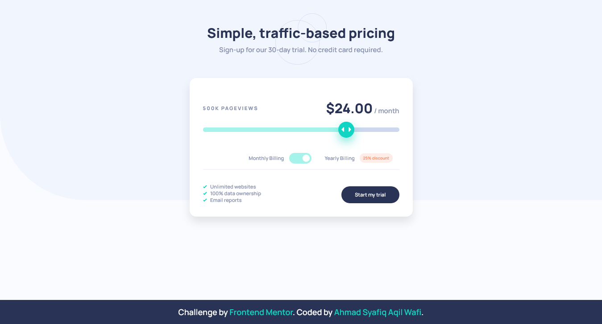

# Frontend Mentor - Interactive pricing component solution

This is a solution to the [Interactive pricing component challenge on Frontend Mentor](https://www.frontendmentor.io/challenges/interactive-pricing-component-t0m8PIyY8). Frontend Mentor challenges help you improve your coding skills by building realistic projects. 

## Table of contents

- [Overview](#overview)
  - [The challenge](#the-challenge)
  - [Screenshot](#screenshot)
  - [Links](#links)
- [My process](#my-process)
  - [Built with](#built-with)
  - [What I learned](#what-i-learned)
  - [Continued development](#continued-development)
  - [Useful resources](#useful-resources)
- [Author](#author)
- [Acknowledgments](#acknowledgments)

**Note: Delete this note and update the table of contents based on what sections you keep.**

## Overview

### The challenge

Users should be able to:

- View the optimal layout for the app depending on their device's screen size
- See hover states for all interactive elements on the page
- Use the slider and toggle to see prices for different page view numbers

### Screenshot

#### Desktop Preview

#### Mobile Preview

### Links

- Solution URL: [Github](https://github.com/syafiqjos/frontendmentor.io-solution/tree/main/Junior/Interactive%20Pricing%20Component)
- Live Site URL: [Live](https://syafiqjos.github.io/frontendmentor.io-solution/Junior/Interactive%20Pricing%20Component/index.html)

## My process

### Built with

- Semantic HTML5 markup
- CSS custom properties
- Flexbox
- CSS Grid
- Desktop-first workflow
- Vanilla js and css
- Custom range / slide input

### What I learned

I learned so much from this project.

- Range Input

I just knew that there is something called Range Input @.@. Basically it's an input element / tag with range as its type.

I knew this after I messing up by creating a mimic of this Range Input haha. Well, at least it doesn't go in vain, i learn more actually.

- Custom Range Input

I could modify some of Range Input component after searching for tutorial on internet. But I still can't manage to show image on slider thumb in Chrome. But I managed to do good in Firefox. I'm not sure what cause it.

- CSS Custom Properties with Javascript

I learn about how to add custom properties or css variable from javascript. I do this to add some effect into Slider Bar.

- I learn that I could add image in css content properties

I always use `::before` or `::after` to put image, I just knew that I also can add Image in the base class too.

- Linear gradient has another parameter

I just knew that `lineargradient` also has range of continuity of color.

- Different approach for each browser version and type

Now I know why Front end development is hard. Each browser has its own approach and mechanic. Some css doesn't work on other browser. So it's developer job to optimize all of features become reality in every browser, though it's seems impossible.

### Continued development

I'd like to know how to format string into 0.00 format. I could do it in C# using toString('0.00') but i do not know how to achieve that in javascript.

### Useful resources

- [Custom Range Input](https://developer.mozilla.org/en-US/docs/Web/CSS/::-moz-range-thumb)
- [Custom Range Input Tutorial](https://www.youtube.com/watch?v=BrpiNUf2XCk)
- [Custom Range Input Cross Browser](https://css-tricks.com/styling-cross-browser-compatible-range-inputs-css/)
- [CSS Custom Properties with javascript](https://css-tricks.com/updating-a-css-variable-with-javascript/)

## Author

- Github - [Ahmad Syafiq Aqil Wafi](https://www.github.com/syafiqjos)
- Frontend Mentor - [@syafiqjos](https://www.frontendmentor.io/profile/syafiqjos)
- Instagram - [@syafiqwafi](https://www.instagram.com/syafiqwafi)

## Acknowledgments

Thank you to Layout Land, Kevin Powell and Banana Coding on their youtube video.

Also thanks to frontendmentor community!
