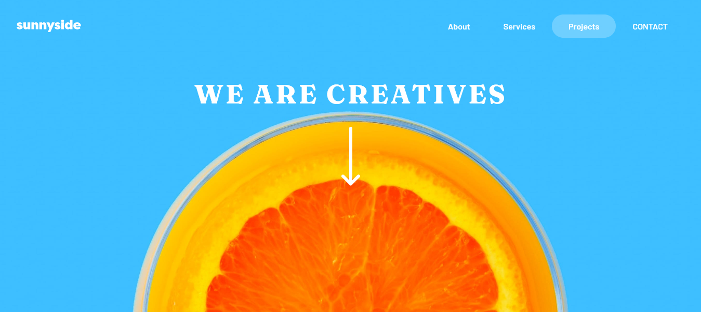
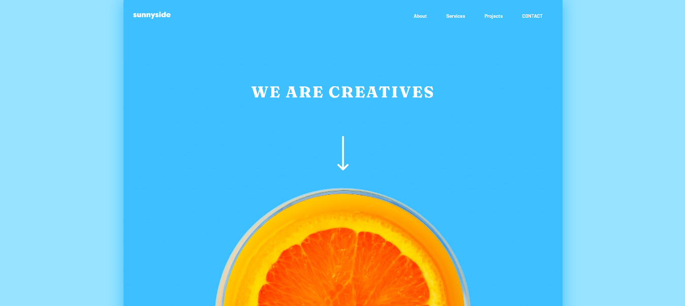
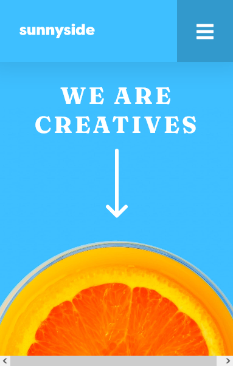

# Frontend Mentor - Sunnyside agency landing page solution

This is a solution to the [Sunnyside agency landing page challenge on Frontend Mentor](https://www.frontendmentor.io/challenges/sunnyside-agency-landing-page-7yVs3B6ef). Frontend Mentor challenges help you improve your coding skills by building realistic projects.

## Table of contents

- [Overview](#overview)
  - [The challenge](#the-challenge)
  - [Screenshot](#screenshot)
  - [Links](#links)
- [My process](#my-process)
  - [Built with](#built-with)
  - [What I learned](#what-i-learned)
  - [Continued development](#continued-development)
  - [Useful resources](#useful-resources)
- [Author](#author)
- [Acknowledgments](#acknowledgments)

## Overview

### The challenge

Users should be able to:

- View the optimal layout for the site depending on their device's screen size
- See hover states for all interactive elements on the page

### Screenshot

#### Desktop Preview

#### Large Screen Preview

#### Mobile Preview

#### Desktop Full Preview

[Preview](./summary/desktop-full-preview.png)

#### Mobile Full Preview

[Preview](./summary/mobile-full-preview.png)

### Links

- Solution URL: [Github](https://github.com/Syafiqjos/frontendmentor.io-solution/tree/main/Junior/Sunnyside%20Agency%20Landing%20Page)
- Live Site URL: [Live](https://syafiqjos.github.io/frontendmentor.io-solution/Junior/Sunnyside%20Agency%20Landing%20Page/index.html)

## My process

### Built with

- Semantic HTML5 markup
- CSS custom properties
- Flexbox
- CSS Grid
- Desktop-first workflow
- Sass SCSS
- Font Awesome

### What I learned

- I learn about anchor link outline.

- I learn how to improve my javascript code.

- I learn about responsive grid with minmax.

- I learn about custom grid order with grid-area.

- I learn about how to use Font Awesome.

- I learn about custom Main and Page html structure.

### Continued development

I wondering how to hide / disable activated dashboard on device mode by clicking outside window.

Also I don't have any idea how to complete the project without Javascript code, since the description says that it's possible to complete the project by only using html and css.

### Useful resources

- [Font Awesome](https://fontawesome.com/) - Even though the project gives a great svg for icon, there is no wrong using Font Awesome.

- [Outline and Focus](https://www.youtube.com/watch?v=Mvu5OMGcdVA) - Kevin Powell about Outline, Hover and Focus.

- [Anchor Without href](https://stackoverflow.com/questions/2886413/anchor-without-href/2886421) - I used it for toggle and outline dashboard.

## Author

- Github - [Ahmad Syafiq Aqil Wafi](https://www.github.com/syafiqjos)
- Frontend Mentor - [@syafiqjos](https://www.frontendmentor.io/profile/syafiqjos)
- Instagram - [@syafiqwafi](https://www.instagram.com/syafiqwafi)

## Acknowledgments

Thank you for Kevin Powell video about outline.

Thank you to frontendmentor.io community!