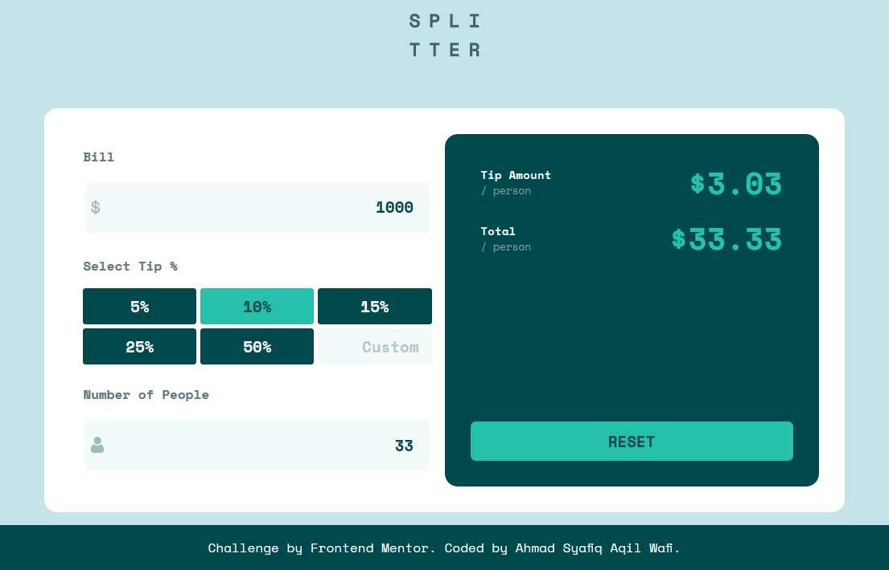
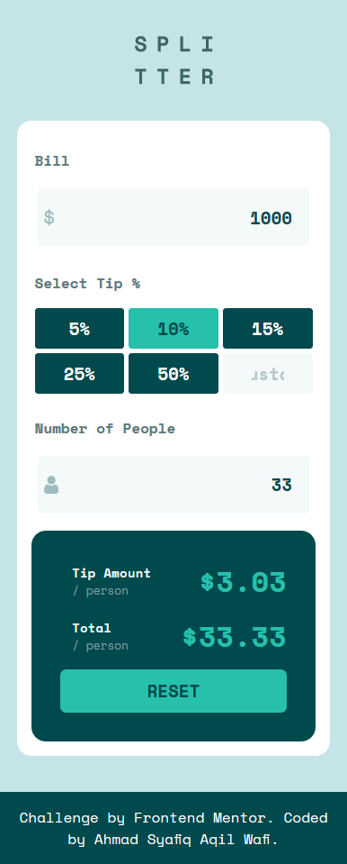

# Frontend Mentor - Tip calculator app solution

This is a solution to the [Tip calculator app challenge on Frontend Mentor](https://www.frontendmentor.io/challenges/tip-calculator-app-ugJNGbJUX). Frontend Mentor challenges help you improve your coding skills by building realistic projects.

## Table of contents

- [Overview](#overview)
  - [The challenge](#the-challenge)
  - [Screenshot](#screenshot)
  - [Links](#links)
- [My process](#my-process)
  - [Built with](#built-with)
  - [What I learned](#what-i-learned)
  - [Continued development](#continued-development)
  - [Useful resources](#useful-resources)
- [Author](#author)
- [Acknowledgments](#acknowledgments)

## Overview

### The challenge

Users should be able to:

- View the optimal layout for the app depending on their device's screen size
- See hover states for all interactive elements on the page
- Calculate the correct tip and total cost of the bill per person

### Screenshot

#### Desktop Preview



#### Mobile Preview



### Links

- Solution URL: [Github](https://github.com/Syafiqjos/frontendmentor.io-solution/tree/main/Junior/Tip%20Calculator%20App)
- Live Site URL: [Live](https://syafiqjos.github.io/frontendmentor.io-solution/Junior/Tip%20Calculator%20App)

## My process

### Built with

- Semantic HTML5 markup
- SASS and SCSS
- Flexbox
- Grid Template Area
- Desktop-first workflow
- ::before and ::after pseudo
- functional Javascript

### What I learned

I learned so much and try to use other method!

- I try to use sass with scss instead of css

I started to learn sass yesterday and decided to put it on work. Unbelieveable! it's dang good!! I probably will use it more in the future if it's capable to use sass instead of css. But I'll need to keep learning about css since sass still based from it.

- My first javascript that i write all by alone

Reading some articles, watching some videos, but I never use javascript on my own. But in this project I tried to write my own without looking at tutorial! It's bit challenging though, since javascript is such a weird language, haha!

- Grid Area is OP

I always use flexbox for centering something, also grid template columns if it's needed. But I never use Grid Templte Area before. I decided to use and learn it on the Tip Amount and Total Bill per person. It's really useful! I even try to make it responsive, and it's turns out good.

- Such a long time to create something as simple is this

I don't know if the others feels like me, but it's took a very long time to create this simple bill calculator. I need to make the frame, add some css, add hover effects, make it responsive on any device, and finally add the javascript. Also I forgot to mention about test, trial and error. It's give me motivation to practice more.

- Data attributes is good for saving data in the html

On javascript I use `data-` attribute to save the percentage value of tip button. It's easy to use and really useful.

```js
// Get data-percentage attribute on html
tip = this.dataset['percentage'];
```

### Continued development

If I have time, I would like to give an linear interpolation animation on the Tip Amount and Total Bill text, which I usually use as tweening in a game development. So it's not static change but more smooth interpolation.

### Useful resources

- https://www.w3schools.com/howto/howto_css_hide_arrow_number.asp
- https://sass-lang.com
- https://www.youtube.com/watch?v=Zz6eOVaaelI

## Author

- Github - [Ahmad Syafiq Aqil Wafi](https://www.github.com/syafiqjos)
- Frontend Mentor - [@syafiqjos](https://www.frontendmentor.io/profile/syafiqjos)
- Instagram - [@syafiqwafi](https://www.instagram.com/syafiqwafi)

## Acknowledgments

Thank you to Dev Ed who make a great sass introduction.

And to Kevin Powell videos about sass file organization.

Also thank you to frontendmentor.io community!