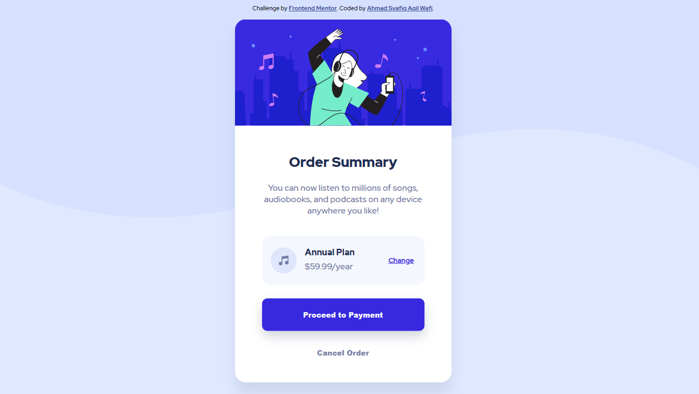
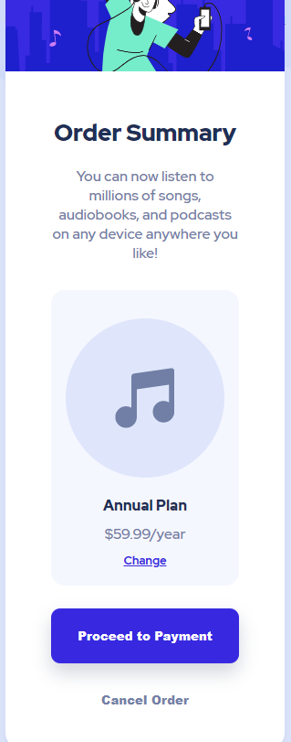

# Frontend Mentor - Order summary card solution

This is a solution to the [Order summary card challenge on Frontend Mentor](https://www.frontendmentor.io/challenges/order-summary-component-QlPmajDUj). Frontend Mentor challenges help you improve your coding skills by building realistic projects. 

## Table of contents

- [Overview](#overview)
  - [The challenge](#the-challenge)
  - [Screenshot](#screenshot)
  - [Links](#links)
- [My process](#my-process)
  - [Built with](#built-with)
  - [What I learned](#what-i-learned)
  - [Continued development](#continued-development)
  - [Useful resources](#useful-resources)
- [Author](#author)
- [Acknowledgments](#acknowledgments)

## Overview

### The challenge

Users should be able to:

- See hover states for interactive elements

### Screenshot

#### Desktop and Mobile Preview

#### Smaller Screen Preview

### Links

- Solution URL: [https://github.com/Syafiqjos/frontendmentor.io-solution/tree/main/Newbie/Order%20Summary%20Component](https://github.com/Syafiqjos/frontendmentor.io-solution/tree/main/Newbie/Order%20Summary%20Component)
- Live Site URL: [https://syafiqjos.github.io/frontendmentor.io-solution/Newbie/Order%20Summary%20Component/](https://syafiqjos.github.io/frontendmentor.io-solution/Newbie/Order%20Summary%20Component/)

## My process

### Built with

- Semantic HTML5 markup
- CSS Custom Properties
- CSS Grid
- CSS Flexbox

### What I learned

- Border radius has 4 different type.

I always use border-radius but never knew that there are separated function. I learned about it when working on hero image where the top border is curved but the bottom border is stay flat.

- Better understanding on Color Choice.

I loved dark-theme, thats why I always made dark-theme everytime since the color choice is easy, if it's not black, then gray and white. But in this challenge, I learned that white-theme is not that bad, actually it's good. I wish I could pick my own white-theme color palette next time.

- Everything is not Image

I shocked and realize that all provided assets are svg. I thought the hero image is at least png, but I was wrong it was svg. Also Not all svg is complete svg, like the background in the body background is just a filled bezier line in the top side, the bottom side is doesn't exist like png image.

- Not everything need width and height

I struggle about sizing the modal box. Since my screen is small so it's perfect case for me. I realize that after I delete width or height css, the block is resize automatically based on its content.

- Typography choice can be more than one

I just knew that I could select more than one size / weight in google fonts without separated import. I realize this after reading provided style-guide.

### Continued development

- Mobile-first is better than Desktop-first in this challenge.

After done with the challenge I realize that I could work with mobile-first development instead of desktop-first since the provided assets and designs are made for mobile.

- Strange Behaviour

Also there is a strange and weird behaviour in my work. Firefox and chrome gives a different display scale. Is it because of units rm, or px? I don't know why, but my chrome gives a better display or preview than firefox since I use chrome when building this challenge.

### Useful resources

- [Github Pages](https://docs.github.com/en/pages/getting-started-with-github-pages/creating-a-github-pages-site#creating-a-repository-for-your-site)

Actually kinda weird, write this Github Pages resource, but at least this is place where you can deploy static pages on github. It's free and easy, go check it out!

- [Box Shadow](https://www.w3schools.com/cssref/css3_pr_box-shadow.asp)

I always forget about box-shadow syntax on css.

## Author

- Github - [Ahmad Syafiq Aqil Wafi](https://www.github.com/syafiqjos)
- Frontend Mentor - [@syafiqjos](https://www.frontendmentor.io/profile/syafiqjos)
- Instagram - [@syafiqwafi](https://www.instagram.com/syafiqwafi)

## Acknowledgments

Thank you to Vanza Setia for the wonderful feedback! [Feedback](https://www.frontendmentor.io/solutions/order-summary-challenge-with-responsive-grid-and-flexbox-Tl1EBKdmK)

Also thank you to frontendmentor.io community!