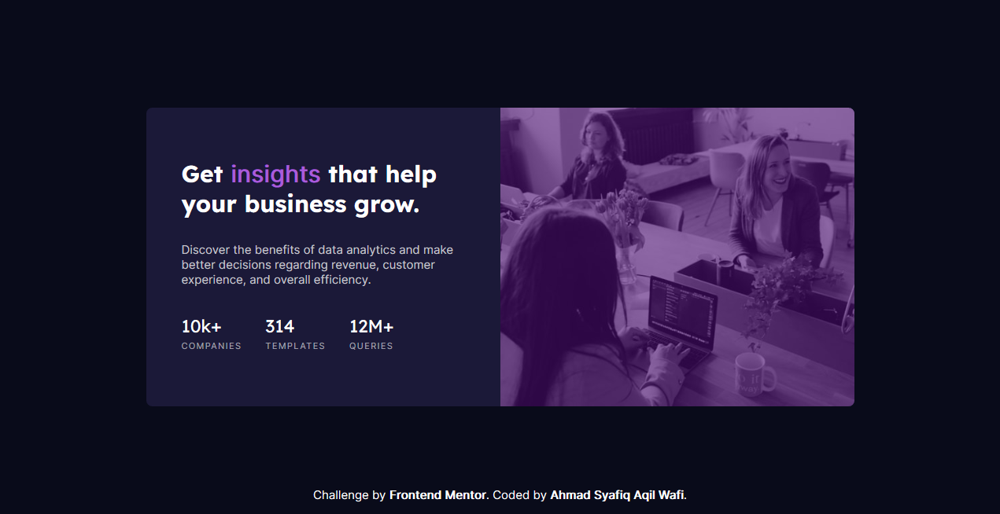
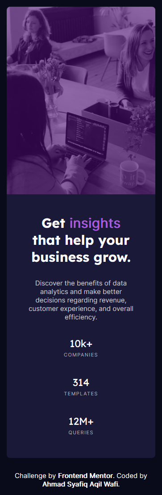

# Frontend Mentor - Stats preview card component solution

This is a solution to the [Stats preview card component challenge on Frontend Mentor](https://www.frontendmentor.io/challenges/stats-preview-card-component-8JqbgoU62). Frontend Mentor challenges help you improve your coding skills by building realistic projects. 

## Table of contents

- [Overview](#overview)
  - [The challenge](#the-challenge)
  - [Screenshot](#screenshot)
  - [Links](#links)
- [My process](#my-process)
  - [Built with](#built-with)
  - [What I learned](#what-i-learned)
  - [Continued development](#continued-development)
  - [Useful resources](#useful-resources)
- [Author](#author)
- [Acknowledgments](#acknowledgments)

## Overview

### The challenge

Users should be able to:

- View the optimal layout depending on their device's screen size

### Screenshot

#### Desktop Preview



#### Smaller Desktop Preview


#### Mobile Preview



### Links

- Solution URL: [Github](https://github.com/Syafiqjos/frontendmentor.io-solution/tree/main/Newbie/Stats%20Preview%20Card%20Component)
- Live Site URL: [syafiqjos.github.io](https://syafiqjos.github.io/frontendmentor.io-solution/Newbie/Stats%20Preview%20Card%20Component/)

## My process

### Built with

- Semantic HTML5 markup
- Flexbox
- CSS Grid
- Desktop-First workflow
- Min-max function

### What I learned

Finally, I realized that not every browser support function that support in another browser. Because of this, I must add some line where the the old browser is capable to.

As example, I must add `width: 900px` so the `modal-box` in firefox has some size. If somehow I remove that line, the `modal-box` will bugged since it doesn't support `min` function.

```css
width: 900px;
width: min(900px, 100%);
```

I also learned that I could select multiple font-family in single css `@import`, I always though that one link can only import one font family too.

I learned that we can reorder element from css too. At the first time I was confused about the hero image. In desktop version it is on the right side, but in mobile version it is on the top. So I try to make the hero image absolute, so I could rearrange and place it as I pleased.

### Continued development
There is some firefox feature / function which is not cappable to in my opinion. I'll read more about browser support/

### Useful resources
https://developer.mozilla.org/en-US/docs/Web/CSS/min()

## Author

- Github - [Ahmad Syafiq Aqil Wafi](https://www.github.com/syafiqjos)
- Frontend Mentor - [@syafiqjos](https://www.frontendmentor.io/profile/syafiqjos)
- Instagram - [@syafiqwafi](https://www.instagram.com/syafiqwafi)

## Acknowledgments

Thank you to frontendmentor.io community!